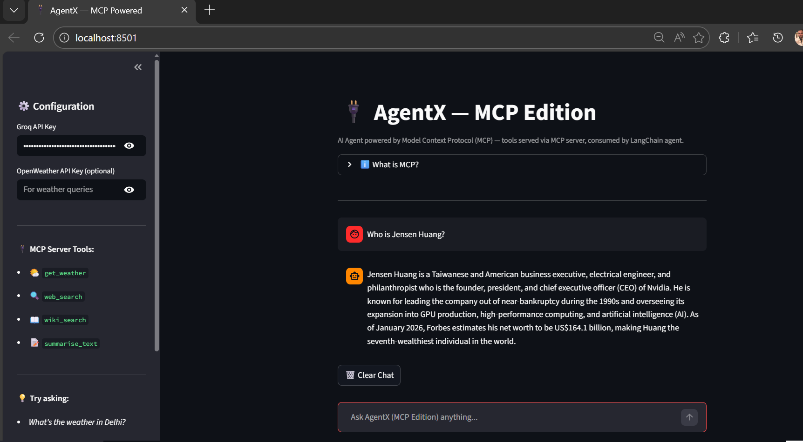

# 🔌 MCP Tools Server

<p align="center">
  
  
  
  
  
</p>

> A **Model Context Protocol (MCP) server** that exposes AI-powered tools — Weather, Web Search, Wikipedia & Text Summariser — consumable by any MCP-compatible AI client including Claude Desktop, custom agents, and more.

---

## 🚀 Demo



---

## 🧠 What is MCP?

**Model Context Protocol (MCP)** is an open standard by Anthropic that works like **USB for AI** — just as USB lets any device connect to any computer, MCP lets any AI model connect to any tool or data source in a standardised way.

```
┌─────────────────┐      MCP Protocol       ┌──────────────────────┐
│                 │  ← list_tools()          │                      │
│   MCP CLIENT    │  ← call_tool(name, args) │    MCP SERVER        │
│  (Claude / Agent│  → tool result           │  (This repo)         │
│   / Any AI)     │                          │  Weather, Search,    │
│                 │                          │  Wikipedia, Summarise│
└─────────────────┘                          └──────────────────────┘
```

### Without MCP vs With MCP

| Without MCP | With MCP |
|---|---|
| Custom integration per AI model | One server, any AI connects |
| Hardcoded tool calls | Standardised protocol |
| Difficult to scale | Plug & play tools |
| Tightly coupled | Loosely coupled |

---

## 🛠️ Tools Exposed

| Tool | Description | API Required |
|---|---|---|
| `get_weather` | Current weather for any city | OpenWeatherMap (free) |
| `web_search` | Real-time web search via DuckDuckGo | None |
| `wiki_search` | Wikipedia factual search | None |
| `summarise_text` | Summarise text into bullet points | Groq (free) |

---

## 🏗️ Architecture

```
mcp-tools-server/
│
├── server.py           # MCP server — registers & exposes tools
├── client.py           # MCP client — connects, discovers, builds agent
├── app.py              # Streamlit chat UI
│
├── tools/
│   ├── __init__.py
│   ├── weather.py      # Weather logic
│   ├── search.py       # DuckDuckGo search logic
│   ├── wikipedia.py    # Wikipedia search logic
│   └── summariser.py   # LLM summariser logic
│
├── requirements.txt
├── .env.example
└── README.md
```

### How It Works

```
1. server.py starts → registers 4 tools via @server.list_tools()
2. client.py connects → calls list_tools() → discovers all 4 tools
3. Client wraps MCP tools as LangChain tools
4. LangChain agent is built with those tools + Groq LLM
5. User asks question → Agent decides which tool → MCP call_tool() executes it
6. Result returned to agent → Agent generates final response
```

---

## ⚙️ Setup & Installation

### 1. Clone the repo
```bash
git clone https://github.com/chhabralovish/mcp-tools-server.git
cd mcp-tools-server
```

### 2. Create virtual environment
```bash
python -m venv venv
venv\Scripts\activate        # Windows
source venv/bin/activate     # Mac/Linux
```

### 3. Install dependencies
```bash
pip install -r requirements.txt
```

### 4. Configure API keys
```bash
cp .env.example .env
# Add GROQ_API_KEY (required)
# Add OPENWEATHER_API_KEY (optional)
```

### 5. Run options

**Option A — Streamlit UI**
```bash
streamlit run app.py
```

**Option B — Terminal (test client directly)**
```bash
python client.py
```

**Option C — Run server standalone**
```bash
python server.py
```

---

## 🔌 Connect Claude Desktop to This MCP Server

Add this to your Claude Desktop config (`claude_desktop_config.json`):

```json
{
  "mcpServers": {
    "mcp-tools-server": {
      "command": "python",
      "args": ["/full/path/to/mcp-tools-server/server.py"],
      "env": {
        "GROQ_API_KEY": "your_groq_key",
        "OPENWEATHER_API_KEY": "your_weather_key"
      }
    }
  }
}
```

After restarting Claude Desktop, it will have access to all 4 tools from this server! 🎉

---

## 🔑 API Keys

| Service | Link | Cost |
|---|---|---|
| Groq | [console.groq.com](https://console.groq.com/) | ✅ Free |
| OpenWeatherMap | [openweathermap.org](https://openweathermap.org/api) | ✅ Free tier |
| DuckDuckGo | Built-in | ✅ No key needed |
| Wikipedia | Built-in | ✅ No key needed |

---

## 💡 Example Queries

```
🌤️  "What's the weather in Mumbai right now?"
🔍  "Search for latest developments in MCP protocol"
📖  "Who invented the transformer architecture?"
📝  "Summarise: [paste any long article]"
```

---

## 👨‍💻 Author

**Lovish Chhabra** — Data Scientist & AI Engineer

[](https://www.linkedin.com/in/lovish-chhabra/)
[](https://github.com/chhabralovish)

---

## 📄 License

MIT License — free to use, modify and distribute.
